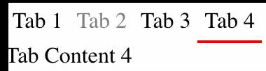

# vuejs-tabs



## props

### TabsContainer

```js
props: {
  defaultTab: {
    type: [Number, String],
    default: 0
  }
}
```

### Tab

```js
props: {
  disabled: {
    type: Boolean,
    default: false
  },
  hidden: {
    type: Boolean,
    default: false
  }
}
```

## example

```html
<TabsContainer :default-tab="0">
  <template slot="tab">
    <Tab :key="0">Tab 1</Tab>
    <Tab :key="1" disabled>Tab 2</Tab>
    <Tab :key="2">Tab 3</Tab>
    <Tab :key="3">Tab 4</Tab>
  </template>

  <template slot="content">
    <TabContent :key="0">Tab Content 1</TabContent>
    <TabContent :key="1">Tab Content 2</TabContent>
    <TabContent :key="2">Tab Content 3</TabContent>
    <TabContent :key="3">Tab Content 4</TabContent>
  </template>
</TabsContainer>
```
